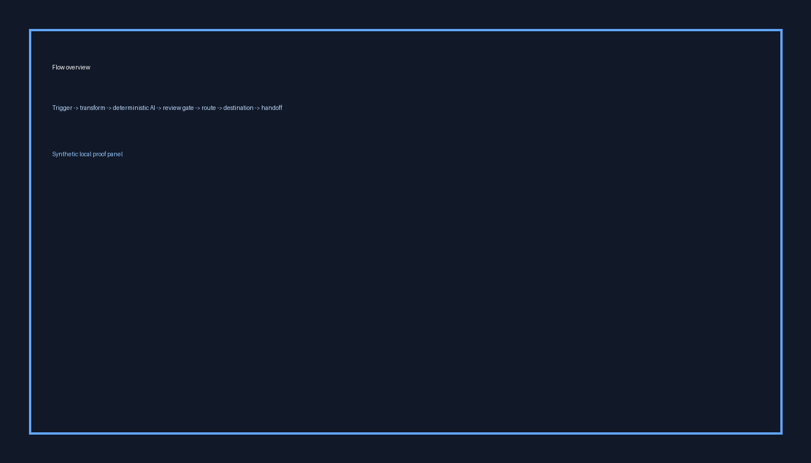
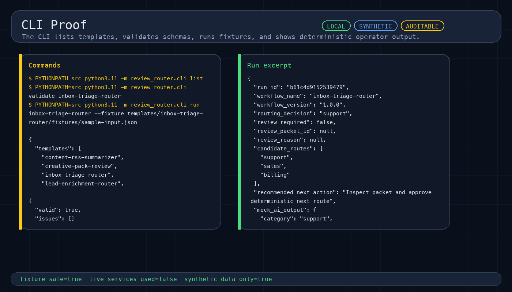
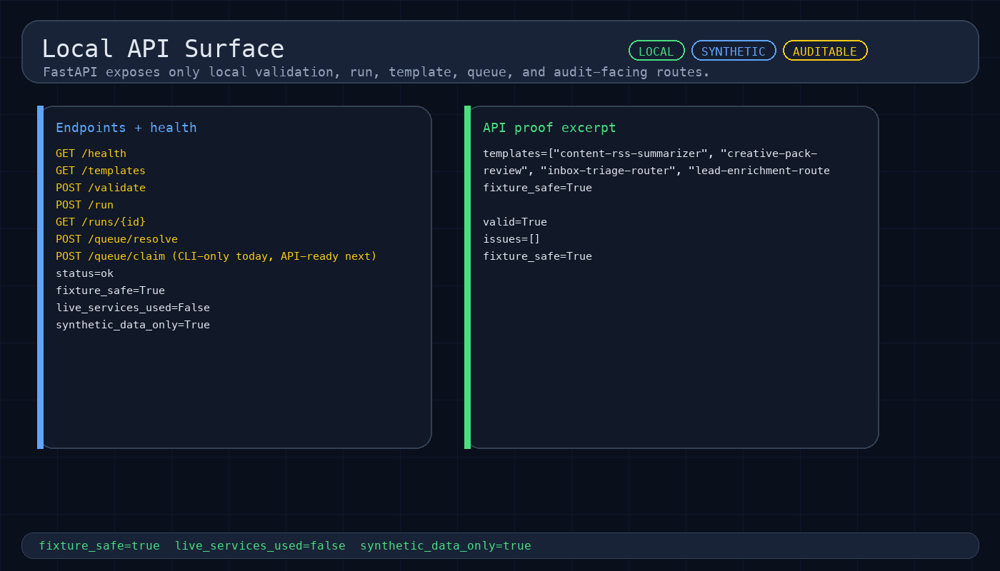
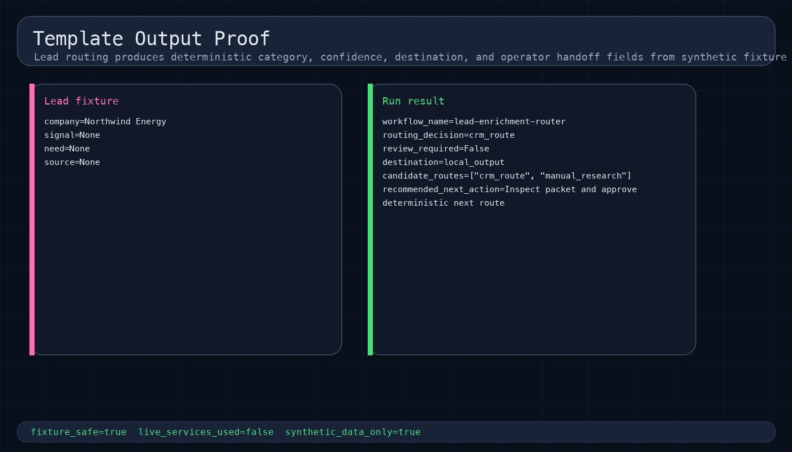
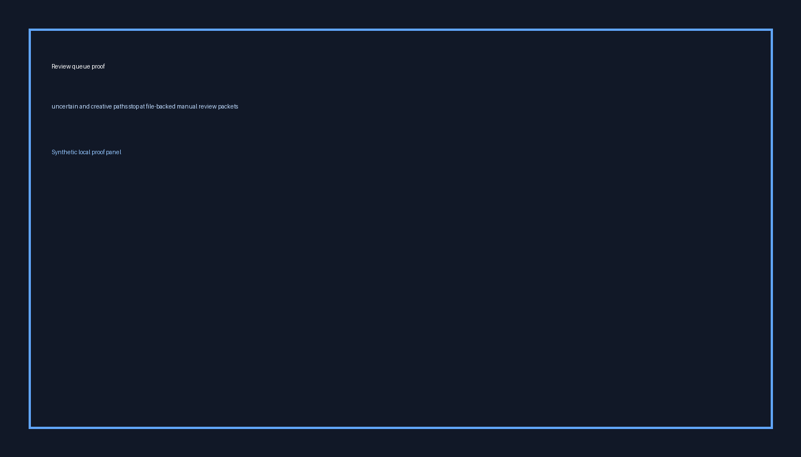
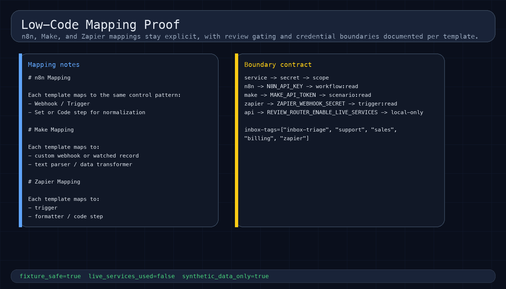
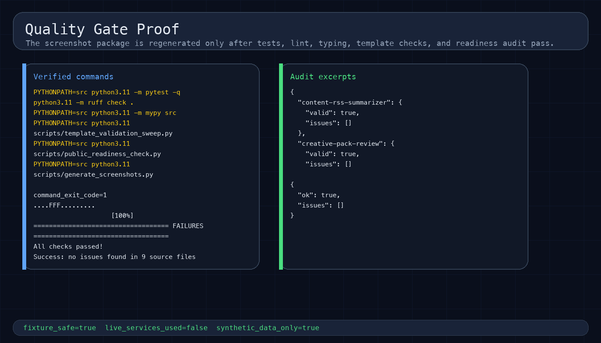
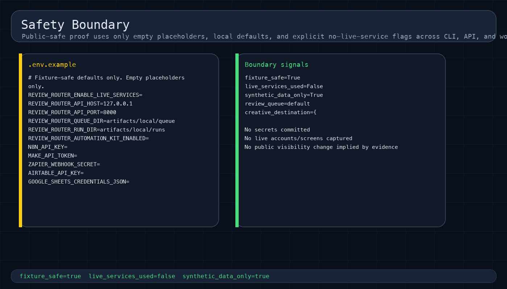

# Review Router

Deterministic, auditable review-gated AI workflow templates for n8n, Make, Zapier, Python, and API-first automation delivery.

Review Router proves a specific automation-control pattern: add AI classification, summarization, or recommendation steps to workflow systems without losing deterministic routing, audit trails, or a human review boundary. It is a local, fixture-safe proof package for teams that want controlled AI workflow behavior before connecting real credentials or live services.

## What this repository proves

- Typed workflow contracts for trigger, AI step, confidence policy, review gate, route, destination, and handoff metadata.
- Deterministic fixture-safe execution that writes replayable run artifacts and matching audit evidence.
- File-backed review packets for uncertain, ambiguous, or creative outputs that should not auto-route.
- Operator surfaces through both CLI and FastAPI.
- Low-code implementation notes for n8n, Make, and Zapier without claiming live provider execution.
- Public-safe evidence: synthetic fixtures, empty credential placeholders, no customer data, no external side effects.

## What workflows it covers locally

This repo currently ships six workflow families:

| Workflow | Input shape | Automated outcome | Review behavior |
|---|---|---|---|
| Lead enrichment router | lead payload with enrichment hints | route toward CRM-ready, nurture, or research lanes | low-confidence enrichment can stop for manual routing |
| Inbox triage router | inbound message/email-style payload | classify into support, sales, billing, or review | ambiguous messages produce a review packet |
| Support urgency sentiment | support ticket payload | assign urgency and escalation recommendation | borderline severity can require manual confirmation |
| Content RSS summarizer | article/feed item payload | summarize and route toward publish, queue, or review | risky or unclear summaries stop for review |
| Creative pack review | creative brief payload | classify whether output can proceed or needs signoff | intentionally review-heavy by design |
| Workflow debug replay | broken automation/debug packet | route toward repair, replay, or escalation notes | uncertain failure interpretation can require review |

These are local proof scenarios, not live-provider claims. The fixtures are synthetic and the routes are deterministic.

## Why this repo exists

Review Router sits between the two other common automation proof shapes:

- `api-webhook-bridge` proves the approved happy path: accept one event, validate it, map it, and emit destination-shaped evidence.
- `automation-debugger` proves the failure path: inspect a broken event, classify the problem, and decide whether replay is safe.
- `review-router` proves the control path: when an AI step is useful but should not always auto-commit, stop at a typed review boundary with deterministic artifacts.

That makes this repository the workflow-control and review-gate proof in the broader automation factory set.

## Safety boundary

Synthetic fixtures only. Empty credential placeholders only. No live external-service calls, customer data, cloud resources, public visibility changes, releases, or external sharing actions are part of this local proof. Public export, live external-service proof, credentials, and GitHub visibility changes remain human-gated.

## Quick start

```bash
python3.11 -m venv .venv
source .venv/bin/activate
pip install -e '.[dev]'
PYTHONPATH=src python3.11 -m pytest -q
PYTHONPATH=src python3.11 -m review_router.cli list
```

## Run the local walkthrough

A minimal operator walkthrough looks like this:

```bash
PYTHONPATH=src python3.11 -m review_router.cli list
PYTHONPATH=src python3.11 -m review_router.cli validate inbox-triage-router
PYTHONPATH=src python3.11 -m review_router.cli run inbox-triage-router --fixture templates/inbox-triage-router/fixtures/sample-input.json
PYTHONPATH=src python3.11 -m review_router.cli queue list
PYTHONPATH=src python3.11 -m review_router.cli replay <run_id>
```

What this proves:
- templates are discoverable from a clean checkout;
- workflow contracts validate before execution;
- deterministic runs emit local artifacts and audit evidence;
- review-required cases become file-backed queue packets;
- replay confirms the same run contract can be reproduced.

## CLI surface

```bash
review-router list
review-router validate <template>
review-router run <template> --fixture <path>
review-router replay <run_id>
review-router queue list
review-router queue claim <packet_id> --reviewer stefan
review-router queue resolve <packet_id> --reviewer stefan --decision approve --note "Approved"
```

## Local API surface

```bash
GET  /health
GET  /templates
POST /validate
POST /run
GET  /runs/{id}
POST /queue/resolve
```

Health contract from the local API:

```json
{
  "status": "ok",
  "fixture_safe": true,
  "live_services_used": false,
  "synthetic_data_only": true
}
```

## Evidence package

The screenshot package below is generated from local synthetic evidence and is meant to show the repo as a proof system, not just as source code.

[](docs/screenshots/01-flow-overview.png)

[](docs/screenshots/02-cli-proof.png)

[](docs/screenshots/03-api-openapi.png)

[](docs/screenshots/04-template-output-proof.png)

[](docs/screenshots/05-review-queue-proof.png)

[](docs/screenshots/06-low-code-mapping-proof.png)

[](docs/screenshots/07-quality-gates.png)

[](docs/screenshots/08-safety-boundary.png)

Supporting written evidence:

- `docs/evidence.md`
- `docs/screenshots/README.md`
- `docs/sandbox-walkthrough.md`
- `docs/case-study.md`

The screenshots are generated proof panels from local synthetic fixtures. They show no live account screens, credentials, browser tabs, private desktop context, or customer data.

## How the review gate works

Review Router is built for automation steps where a normal rule engine is too rigid but full autonomy is too risky.

The contract is:
1. validate the workflow definition;
2. run a deterministic classifier/router over a synthetic fixture;
3. attach confidence and route metadata;
4. auto-complete when policy allows;
5. otherwise write a file-backed review packet for a human operator.

This makes the repo suitable for proving patterns like:
- AI-assisted triage with a human signoff boundary;
- content or creative routing that should pause before publish;
- support escalation suggestions that must remain auditable;
- workflow repair or replay recommendations that should be reviewed before action.

## Built on Automation Kit vocabulary

Review Router is a thin spoke around Automation Kit conventions while remaining fully standalone. It reuses the same broad design stance: typed workflow contracts, deterministic fixtures, synthetic evidence, and explicit safety boundaries. See `docs/automation-kit-backbone.md`.

## Project docs

| Path | Purpose |
|---|---|
| `docs/architecture.md` | package boundaries, runtime flow, and credential boundary model |
| `docs/api.md` | local FastAPI integration surface |
| `docs/case-study.md` | problem framing and workflow families |
| `docs/evidence.md` | reproducible verification commands and proof notes |
| `docs/sandbox-walkthrough.md` | end-to-end fixture-safe operator walkthrough |
| `docs/public-readiness-checklist.md` | public-surface checklist |
| `docs/automation-kit-backbone.md` | backbone relationship and optional integration path |
| `docs/low-code/` | n8n, Make, and Zapier mapping details |
| `docs/proposal-mapping.md` | capability-to-keyword fit and use-case positioning |

## Quality gates

```bash
bash scripts/verify.sh
PYTHONPATH=src python3.11 scripts/public_readiness_check.py
PYTHONPATH=src python3.11 scripts/generate_screenshots.py
```

## Environment

| Variable | Purpose |
|---|---|
| `REVIEW_ROUTER_ENABLE_LIVE_SERVICES` | remains empty for fixture-safe mode |
| `REVIEW_ROUTER_API_HOST` | local API host |
| `REVIEW_ROUTER_API_PORT` | local API port |
| `REVIEW_ROUTER_QUEUE_DIR` | local queue path |
| `REVIEW_ROUTER_RUN_DIR` | local run path |
| `N8N_API_KEY` | placeholder only |
| `MAKE_API_TOKEN` | placeholder only |
| `ZAPIER_WEBHOOK_SECRET` | placeholder only |
| `AIRTABLE_API_KEY` | placeholder only |
| `GOOGLE_SHEETS_CREDENTIALS_JSON` | placeholder only |

## Repository layout

```text
src/review_router/         package modules
templates/                 workflow templates, fixtures, expected outputs
docs/                      architecture, API, evidence, mappings, screenshots
scripts/                   verification and screenshot generation
tests/                     unit and integration tests
artifacts/                 gitignored queue and run outputs created at runtime
```

## License

MIT License. See LICENSE.
