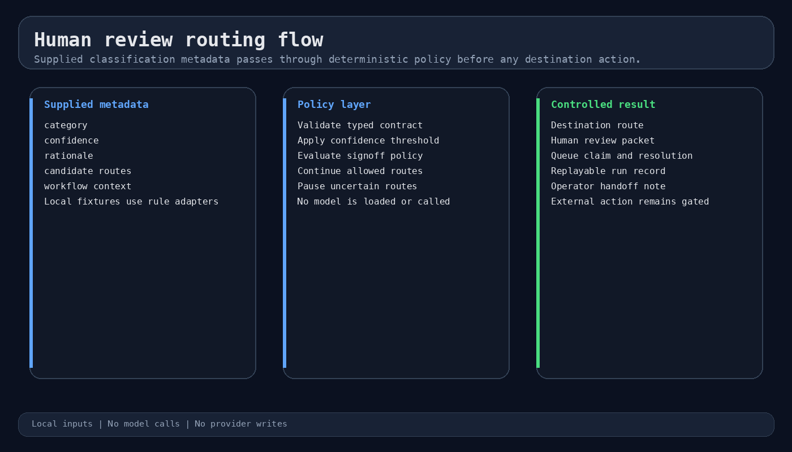
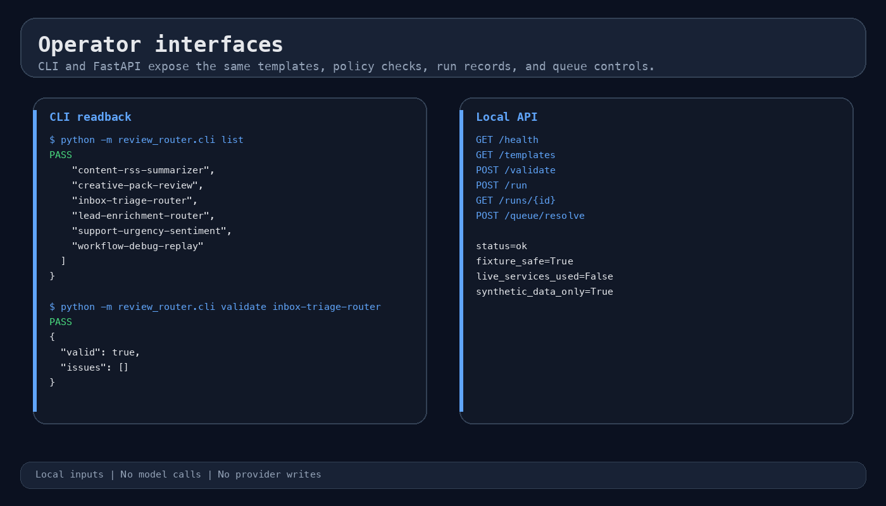
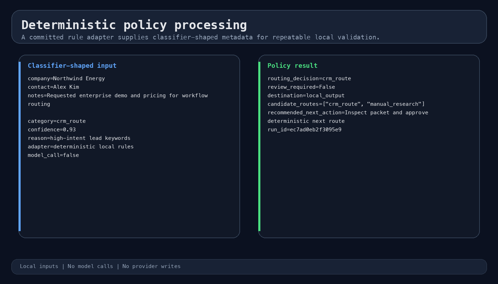
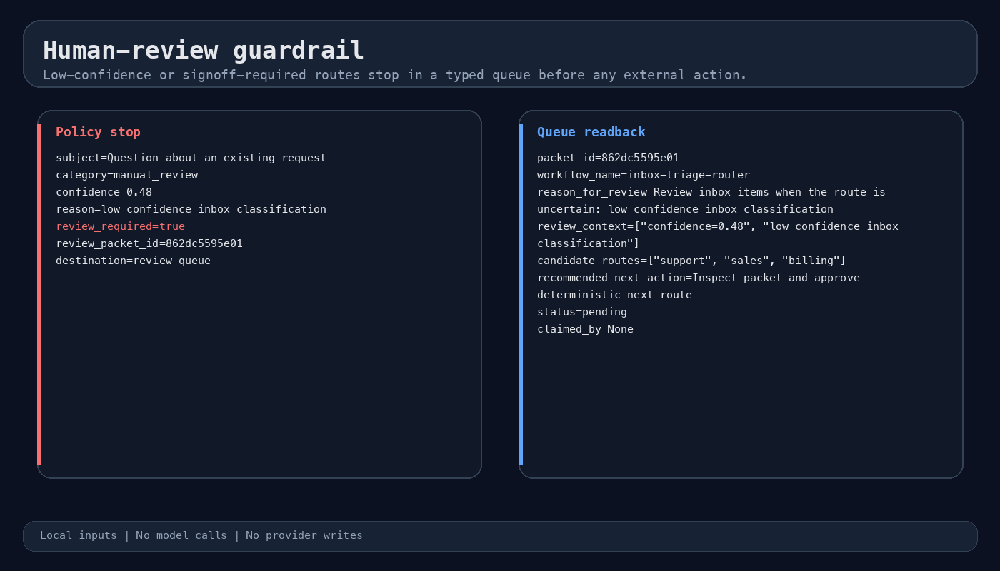
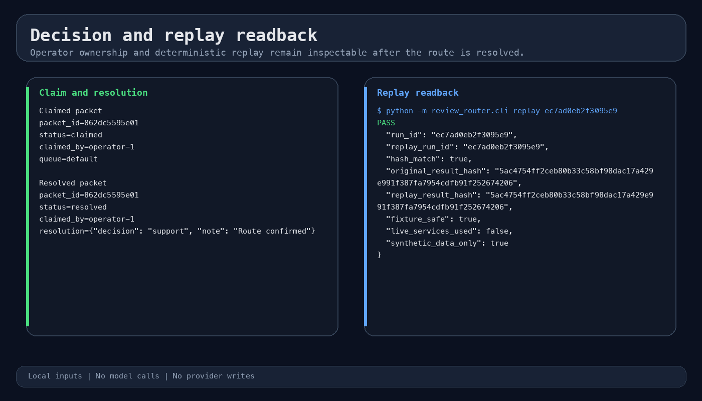
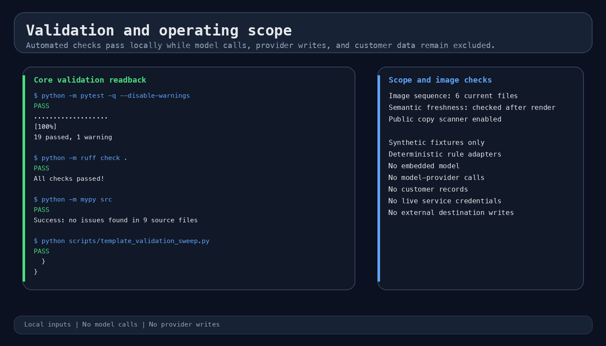

# Human Review Router

Deterministic policy and human-review controls for n8n, Make, Zapier, Python, and API-first automation workflows.

[Case study](docs/case-study.md) | [Architecture](docs/architecture.md) | [Local operation](docs/local-operation.md)

## Overview

**Role:** policy contracts, review routing, CLI/API interfaces, tests and handover documentation. **Status:** an SM Systems reference implementation with reproducible local scenarios.

Human Review Router consumes category, confidence, and rationale fields from an upstream classifier, then applies typed policy to decide whether a workflow can continue or must pause for an operator. The local scenarios use deterministic rule adapters so every route can be reproduced without credentials or provider access.

This repository does not load, host, train, or call an AI model. A production implementation connects an approved upstream classifier at the documented boundary.

## Capabilities

- Typed contracts for triggers, classifier output, confidence policy, review gates, routes, destinations, and handoff metadata.
- Deterministic fixture execution with replayable run records and stable hashes.
- File-backed review packets for ambiguous, low-confidence, or signoff-required outcomes.
- Queue claim and resolution lifecycle for accountable operator decisions.
- Six scenario families covering lead enrichment, inbox triage, support urgency, content routing, creative approval, and workflow-debug routing.
- Integration mapping for n8n, Make, and Zapier without claiming live provider execution.

## Operating flow

1. Validate the workflow contract and incoming payload.
2. Accept category, confidence, and rationale fields from the classifier boundary.
3. Apply deterministic policy to the supplied fields.
4. Continue high-confidence routes that policy allows.
5. Write a review packet when confidence or policy requires an operator decision.
6. Record the selected route, handoff note, and replayable run history.

## Interfaces

- **CLI:** list templates, validate contracts, run fixtures, replay runs, and manage the review queue.
- **FastAPI/OpenAPI:** health, template discovery, validation, execution, run lookup, and queue resolution.
- **Workflow templates:** six typed JSON contracts with fixtures and expected outputs.
- **Integration notes:** n8n, Make, and Zapier mapping details with credential boundaries.

## System views

### System flow



### Interface surface



### Core processing



### Guardrail and failure path



### Output and readback



### Validation and scope



## Run locally

```bash
python3.11 -m venv .venv
source .venv/bin/activate
pip install -e '.[dev]'
PYTHONPATH=src python -m review_router.cli list
PYTHONPATH=src python -m review_router.cli validate inbox-triage-router
PYTHONPATH=src python -m review_router.cli run inbox-triage-router \
  --fixture templates/inbox-triage-router/fixtures/sample-input.json
PYTHONPATH=src python -m review_router.cli queue list
```

Local API routes:

```text
GET  /health
GET  /templates
POST /validate
POST /run
GET  /runs/{id}
POST /queue/resolve
```

## Validation

```bash
bash scripts/verify.sh
PYTHONPATH=src python scripts/generate_screenshots.py
PYTHONPATH=src python scripts/generate_screenshots.py --check
```

## Scope boundaries

Committed scenarios use synthetic inputs, deterministic rule adapters, and empty credential placeholders. They do not call an AI model or any live external service. No customer data, provider write, cloud resource, public-visibility change, release, or external-sharing action is included.

Production use requires an approved classifier, real identity and access controls, provider-specific credentials, persistent storage, monitoring, and operator acceptance testing.

## Project documentation

- [Validation record](docs/validation.md)
- [API contract](docs/api.md)
- [Architecture](docs/architecture.md)
- [Low-code mappings](docs/low-code/)
- [Public-surface checklist](docs/public-readiness-checklist.md)

## License

MIT License. See [LICENSE](LICENSE).

Part of [Stefan's systems and automation portfolio](https://github.com/stefan-mcf#supporting-tools).
